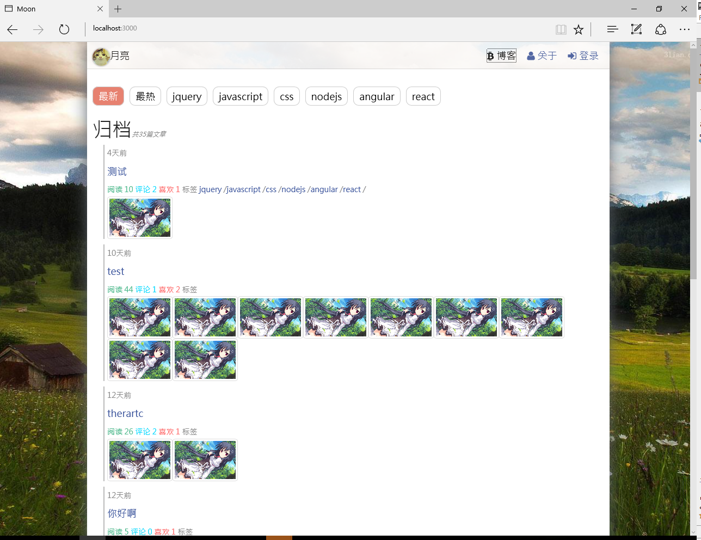
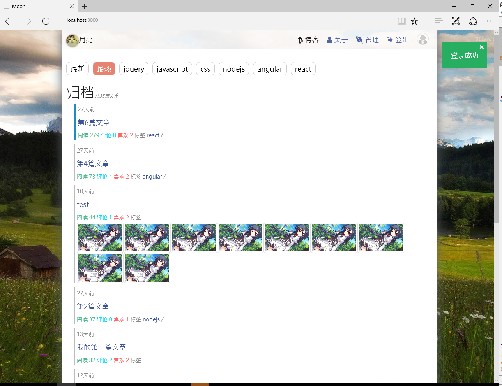
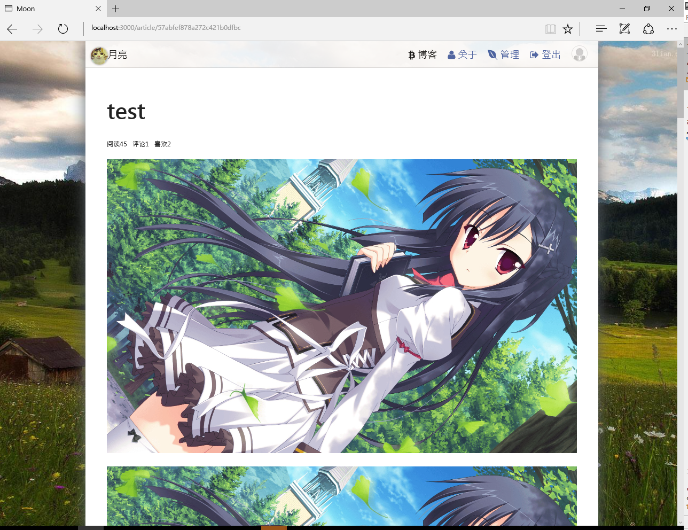
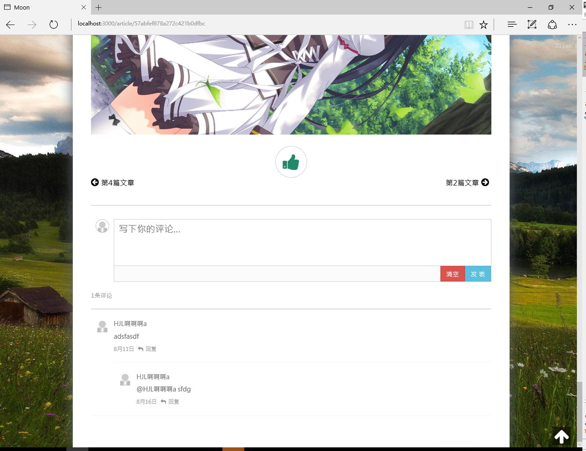
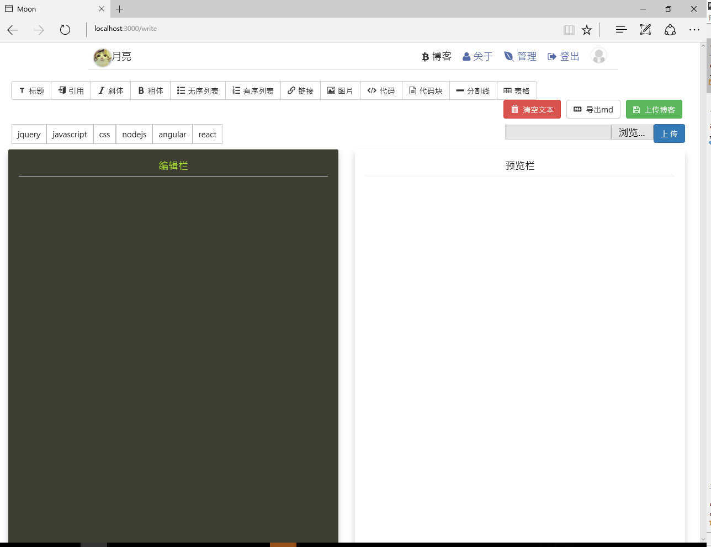
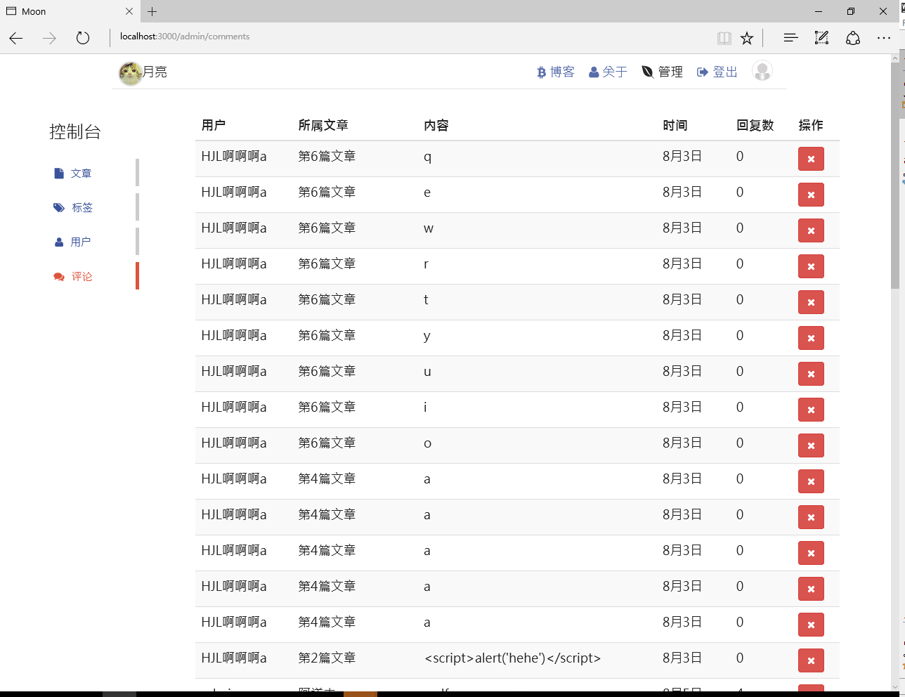

# HJL-Blog 前端部分

## 简介
这是HJL-Blog个人博客的前端部分，使用React+ReactRouter+Redux+ES6+Webpack进行开发。

## 基本功能
用户可以通过第三方账户登录博客，对博客进行评论等操作，管理员登录后可以对文章，评论等内容进行操作，此外管理员可以在博客中使用内置的markdown编辑器（[Markdown-editor](https://github.com/HUJINLIANG/markdown-editor))完成新的博客并发布出来。

##使用

```
$ git clone https://github.com/HUJINLIANG/HJL-Blog-FE.git
$ cd HJL-Blog-FE
$ npm install
```


## dev
```
node server.js
```
在浏览中打开http://localhost:3000

## prod
 
```
$ npm start
```

## 布署

使用pm2进行部署

## ScreenShots








项目demo：[HJL-Blog](http://blog.hjlclould.cn/)

### License
MIT